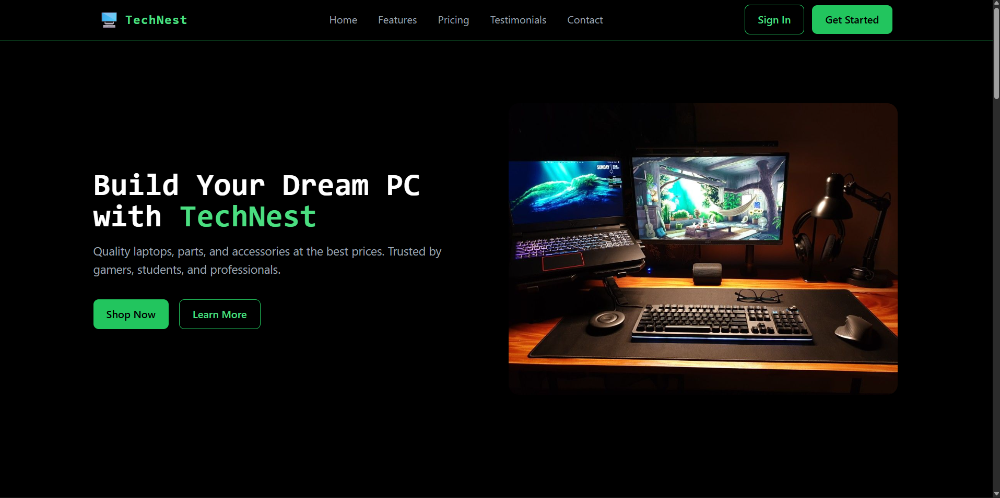
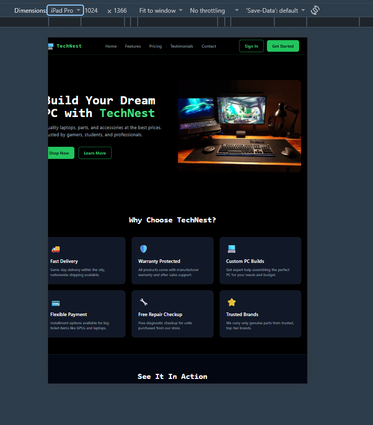
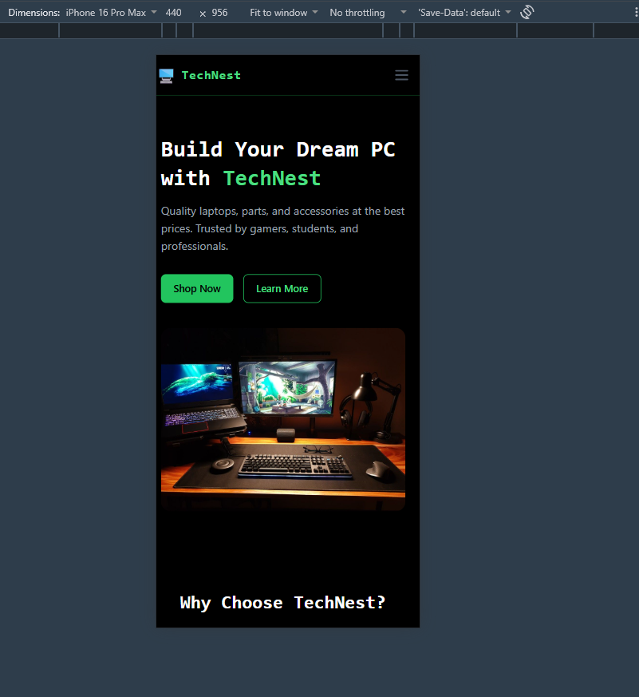
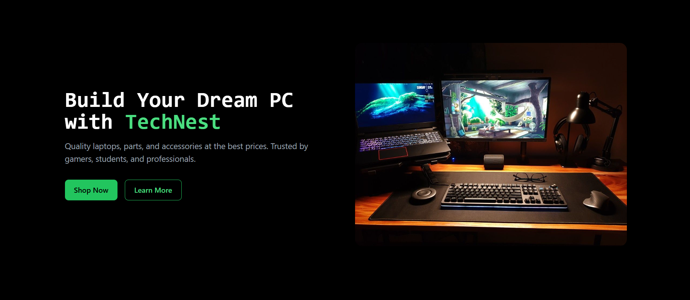
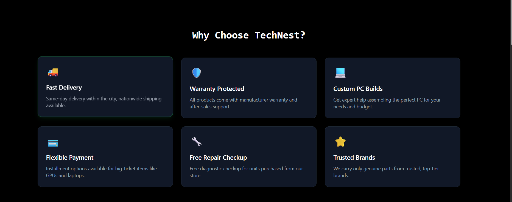
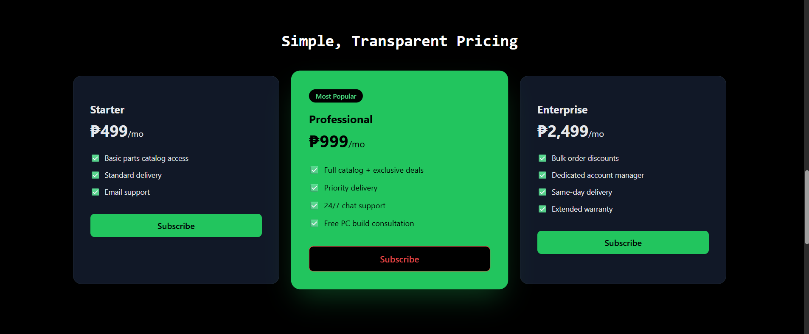
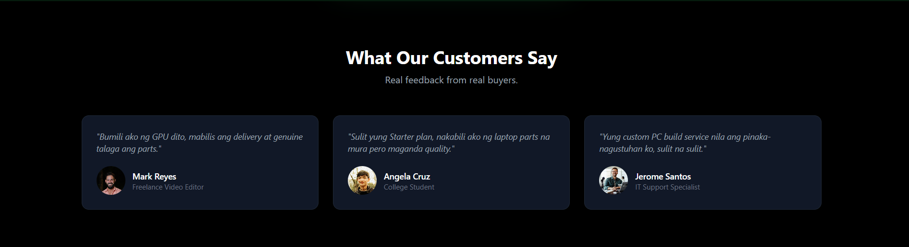
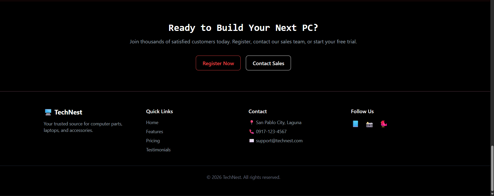

# TechNest - Responsive Product Landing Page

## Introduction
A Product Landing Page is a single, focused web page designed to convert visitors into customers by highlighting a product or service's value clearly. Landing pages are important for businesses because they create a strong first impression, build trust, and guide visitors toward taking action (signing up, contacting sales, or making a purchase).

This project is a landing page for **TechNest**, a local computer parts, laptops, and accessories business, built to showcase its products and services professionally online.

## Objectives
- Developed a responsive web interface using Tailwind CSS.
- Created reusable Blade Components (navbar, hero, feature-card, pricing-card, testimonial-card, button, footer).
- Applied responsive design principles for desktop, tablet, and mobile.
- Organized frontend components following Laravel best practices.
- Implemented consistent UI design using a dark tech-inspired color palette.
- Documented the frontend architecture and component design.
- Published the project through GitHub and LinkedIn.

## Responsive Web Design
- **Mobile-First Design:** Base styles target mobile screens first, then scale up using breakpoints.
- **Responsive Breakpoints:** Tailwind's `sm:`, `md:`, and `lg:` prefixes adjust layouts at 640px, 768px, and 1024px.
- **Flexbox:** Used in the navbar and card layouts (e.g. `flex justify-between items-center`) for aligning items.
- **CSS Grid:** Used for the features, pricing, and testimonials sections (`grid md:grid-cols-3 gap-6`) to arrange cards responsively.
- **User Experience (UX):** Consistent spacing, hover states, and a sticky navbar improve navigation and usability.

Responsive design matters because users access sites from many device sizes; a layout that adapts ensures usability and professionalism across all of them.

## Tailwind CSS
- **Utility-First CSS:** Styling is applied directly via classes (e.g. `bg-black`, `rounded-xl`, `hover:shadow-lg`) instead of writing custom CSS files.
- **Advantages:** Faster development, no context-switching between HTML and CSS files, and consistent design tokens.
- **Responsive Utility Classes:** Example from the project — `grid sm:grid-cols-2 lg:grid-cols-3 gap-6` in the Features section adapts columns per screen size.
- **Component Styling Example:**
```blade
<div class="bg-gray-900 border border-gray-800 p-6 rounded-xl hover:border-green-500/50 transition duration-300 hover:-translate-y-1">
```

## Blade Components
Blade Components are reusable, self-contained UI building blocks in Laravel (e.g. `<x-button>`, `<x-feature-card>`). Instead of repeating the same HTML/CSS across sections, a component is defined once and reused with different data via props.

**Benefits:**
- Eliminates duplicated code across the page.
- Easier maintenance — updating one component file updates it everywhere it's used.
- Encourages modular, organized frontend architecture.

**Example — Feature Card Component:**
```blade
@props(['icon', 'title', 'description'])

<div class="bg-gray-900 p-6 rounded-xl">
    <div class="text-3xl mb-4">{{ $icon }}</div>
    <h3 class="font-semibold text-white">{{ $title }}</h3>
    <p class="text-gray-400 text-sm">{{ $description }}</p>
</div>
```
Used as: `<x-feature-card icon="🚚" title="Fast Delivery" description="..." />`

## User Interface Design
- **Color Palette:** Black background with green (`green-400/500`) and red (`red-500`) accents — a tech/AI-inspired theme.
- **Typography:** Monospace font (`font-mono`) on headings for a technical feel; sans-serif body text for readability.
- **Iconography:** Emoji icons used for features, footer, and quick visual cues.
- **Button Styles:** Three variants — primary (solid green), outline (green border), secondary (red border) — built into one reusable `<x-button>` component.
- **Card Design:** Consistent rounded corners, subtle borders, and hover elevation/glow effects across feature, pricing, and testimonial cards.
- **Layout Consistency:** All sections share the same max-width container (`max-w-7xl`) and vertical spacing (`py-16`) for visual rhythm.

These choices reinforce brand identity and make navigation predictable and visually pleasant for users.

## Folder Structure

**resources/views/layouts/** — Main HTML skeleton (app.blade.php) that all pages extend.

**resources/views/components/** — Reusable Blade Components: navbar, hero, feature-card, pricing-card, testimonial-card, button, footer, etc.

**resources/views/pages/** — Actual page views (home.blade.php).

**public/images/** — Product, dashboard, mobile, and testimonial photos.

**screenshots/** — Device and section screenshots for documentation.

**documentation/** — Before-and-after comparison images.


## Screenshots
### Desktop View


### Tablet View


### Mobile View


### Navigation Bar


### Hero Section


### Features Section


### Pricing Section


### Testimonials


### Footer


## Tech Stack
- Laravel 13
- Tailwind CSS 3
- Alpine.js
- Blade Components

## Author
Developed by Patrick John M. Goco for ITST 302 – Client-Server Technologies, Week 5 Mini Project.